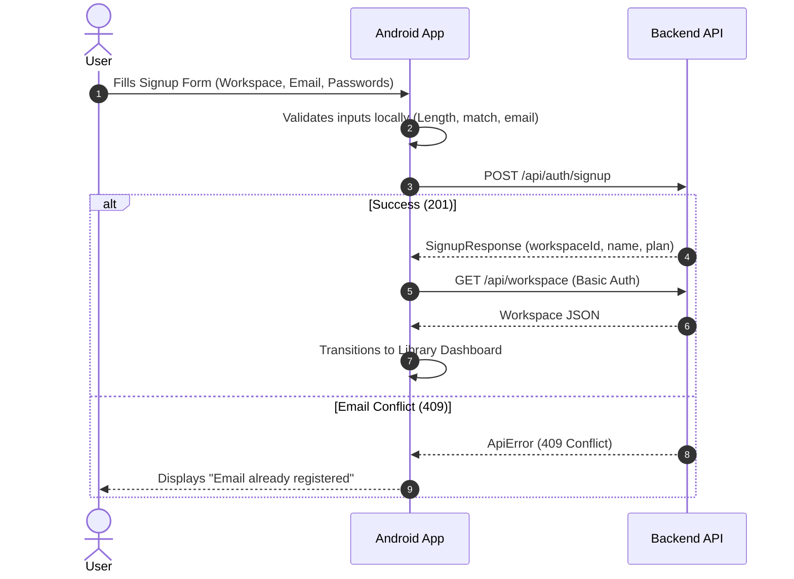

# Booker SaaS: Backend API Overview & Android Client Integration Analysis

This document provides a comprehensive overview of the Booker SaaS backend API structure, workflows, endpoints, contract comparison, and the status of the Android client application integration.

---

## 1. Full Project Structure Analysis

The Booker Android application follows a modern MVVM architecture using Jetpack Compose, Kotlin Coroutines, Flow, Retrofit, and OkHttp SSE.

```
app/src/main/java/com/parvez/booker/
├── MainActivity.kt                            # Activity entry point with Compose theme setup
├── data/
│   ├── model/
│   │   ├── Book.kt                            # Book entity DTO
│   │   ├── BookEvent.kt                       # SSE book payload envelope
│   │   ├── BookRequest.kt                     # Create book payload DTO
│   │   ├── Workspace.kt                       # Workspace metadata and quota DTO
│   │   ├── SignupRequest.kt                   # Signup request payload DTO
│   │   ├── SignupResponse.kt                  # Signup response DTO
│   │   └── ApiError.kt                        # Standardized server error response DTO
│   ├── network/
│   │   ├── BookApi.kt                         # Retrofit API interface
│   │   ├── RetrofitClient.kt                  # Dynamic OkHttpClient & Basic Auth manager
│   │   ├── BookSseManager.kt                  # Lifecycle-aware SSE client & reconnect manager
│   │   └── BookSseEvent.kt                    # Sealed class for SSE events
│   └── repository/
│       ├── BookRepository.kt                  # Central repository abstraction
│       └── CursorStorage.kt                   # Account-scoped SharedPreferences cursor storage
├── ui/
│   ├── components/
│   │   ├── LoginDialog.kt                     # Sign In / Sign Up modal dialog
│   │   ├── WorkspaceBanner.kt                 # Workspace info & quota capacity bar
│   │   ├── AddBookDialog.kt                   # Create book form dialog
│   │   ├── BookDetailsDialog.kt               # ISBN detail modal popup
│   │   ├── BookerBookCard.kt                  # Book list item component
│   │   ├── BookerNoticeBanner.kt              # Real-time SSE alert banner
│   │   ├── BookerSearchBarAndChips.kt         # Search field & filter chips
│   │   ├── BookerStatsStrip.kt                # Summary statistics strip
│   │   └── BookerTopBar.kt                    # App top navigation bar
│   ├── notification/
│   │   └── SystemNotificationHelper.kt        # Android status bar notification manager
│   ├── screen/
│   │   ├── BookerLibraryScreen.kt             # Main library dashboard screen
│   │   └── BookScreen.kt                      # Top-level screen binding
│   ├── theme/                                 # Booker color palette & typography
│   └── viewmodel/
│       ├── BookUiState.kt                     # UI State holder
│       └── BookViewModel.kt                   # ViewModel business logic & state flow
```

---

## 2. Implemented Features, Modules & Configurations

### Core Modules & Services
- **Authentication Service**: In-memory Basic Authentication header management (`Authorization: Basic <base64>`). No tokens, JWTs, or server-side sessions.
- **Workspace Management**: Fetches workspace metadata (`GET /api/workspace`), owner email, active plan (`FREE`/`PRO`), total book limit, books used, and remaining capacity.
- **Catalogue & Search**: Lists books with optional exact `author` and `title` filtering (`GET /api/books`). Retrieves books by ISBN (`GET /api/books/isbn/{isbn}`).
- **Book Creation**: Validates and submits new books (`POST /api/books`) with ISBN (10/13 digits), title, author, published date, description, and reading completion status.
- **Live SSE Events (`GET /api/books/events`)**: Subscribes to real-time `book.created` notifications. Supports `ready` cursors, event deduplication, cursor storage per workspace account, and exponential backoff with jitter.
- **Error Handling**: Parses Spring Boot `ApiError` responses to display server validation errors, 403 quota limits, and 409 conflict messages.
- **System Notifications**: Posts native Android status bar announcements when new books are created in the workspace.

---

## 3. Complete API Endpoint Specifications

| HTTP Method | URL Path | Request Body | Response Body | Auth Required | Validation Rules & Logic |
| :--- | :--- | :--- | :--- | :--- | :--- |
| **POST** | `/api/auth/signup` | `SignupRequest` | `SignupResponse` (201) | Public | `workspaceName`: 1–100 chars; `email`: valid email, max 254 chars; `password`: 12–64 chars. Returns 409 if email exists. |
| **GET** | `/api/workspace` | None | `Workspace` (200) | Basic Auth | Validates credentials. Returns `id`, `name`, `plan`, `book_limit`, `books_used`. Returns 401 on bad credentials. |
| **GET** | `/api/books` | None | `List<Book>` (200) | Basic Auth | Returns array of books in authenticated workspace. |
| **GET** | `/api/books?author=...&title=...` | Query params | `List<Book>` (200) | Basic Auth | Exact match filters. Omit empty filter parameters. |
| **GET** | `/api/books/isbn/{isbn}` | Path param | `Book` (200) | Basic Auth | Retrieves single book by ISBN string. Returns 404 if missing in workspace. |
| **POST** | `/api/books` | `BookRequest` | `Book` (201) | Basic Auth | `isbn`: 10/13 digits; `title` & `author`: 1–255 chars; `publishedDate`: max 20 chars; `description`: max 5000 chars. Returns 403 if quota exceeded, 409 if duplicate ISBN. |
| **GET** | `/api/books/events` | Header: `Last-Event-ID` | SSE Stream (`text/event-stream`) | Basic Auth | Streams `ready` and `book.created` events. Returns 400 on bad cursor, 401 on auth failure, 503 on capacity limit. |
| **GET** | `/actuator/health` | None | Health JSON (200) | Public | Health status check. |
| **GET** | `/v3/api-docs` | None | OpenAPI JSON (200) | Public | Machine-readable API spec. |

> [!IMPORTANT]
> The backend **does not support** editing (`PUT`), deleting (`DELETE`), toggling completion after creation, server-side pagination, or full-text search. The Android client strictly enforces this boundary.

---

## 4. Complete Feature Workflows

### 1. Workspace Registration & Sign-Up


### 2. Sign-In & Verification
1. User enters Email and Password in [`LoginDialog`](file:///home/parvez-hossain/AndroidStudioProjects/Booker/app/src/main/java/com/parvez/booker/ui/components/LoginDialog.kt).
2. App sets credentials in [`RetrofitClient`](file:///home/parvez-hossain/AndroidStudioProjects/Booker/app/src/main/java/com/parvez/booker/data/network/RetrofitClient.kt).
3. App calls `GET /api/workspace`.
4. On **200 OK**: Stores `Workspace` state, fetches initial book list (`GET /api/books`), and starts SSE listener (`GET /api/books/events`).
5. On **401 Unauthorized**: Clears in-memory credentials, stops retries, and displays invalid credentials error.

### 3. Book Creation & Quota Enforcement
1. User opens [`AddBookDialog`](file:///home/parvez-hossain/AndroidStudioProjects/Booker/app/src/main/java/com/parvez/booker/ui/components/AddBookDialog.kt) and inputs book details.
2. App validates ISBN (10/13 digits) and non-blank required fields.
3. App sends `POST /api/books`.
4. On **201 Created**: App adds book to local state, refreshes workspace usage via `GET /api/workspace`, and closes dialog.
5. On **403 Forbidden**: App displays quota limit message ("Workspace quota limit reached") and refreshes workspace usage state.
6. On **409 Conflict**: App displays duplicate ISBN error while preserving user input in form.

### 4. Real-Time SSE Notification Sync
1. App establishes connection to `GET /api/books/events` with Basic Auth and `Accept: text/event-stream`.
2. Includes `Last-Event-ID` header if a saved event cursor exists in [`CursorStorage`](file:///home/parvez-hossain/AndroidStudioProjects/Booker/app/src/main/java/com/parvez/booker/data/repository/CursorStorage.kt).
3. On `ready` event: Saves cursor ID to storage.
4. On `book.created` event:
   - Deduplicates event ID using in-memory set.
   - Saves event ID cursor to [`CursorStorage`](file:///home/parvez-hossain/AndroidStudioProjects/Booker/app/src/main/java/com/parvez/booker/data/repository/CursorStorage.kt).
   - Upserts book in local state.
   - Triggers [`SystemNotificationHelper`](file:///home/parvez-hossain/AndroidStudioProjects/Booker/app/src/main/java/com/parvez/booker/ui/notification/SystemNotificationHelper.kt) status bar notification.
   - Refreshes workspace quota state.
5. On **400 Bad Request** (invalid cursor): Clears stored cursor and resynchronizes.
6. On **401 Unauthorized**: Stops stream and returns to sign-in.
7. On disconnect / timeout: Schedules reconnect with exponential backoff and jitter.

---

## 5. Comparison: Latest Backend vs Frontend Behavior

| Domain | Previously Expected Behavior | Latest Backend Contract & Updated Frontend Implementation |
| :--- | :--- | :--- |
| **Authentication** | Generic login endpoints assumed | HTTP Basic Auth verified via `GET /api/workspace`. Credentials held in memory. |
| **Workspace Info** | No workspace metadata | Workspace details (`id`, `name`, `plan`, `book_limit`, `books_used`, remaining capacity) tracked and displayed. |
| **Sign-Up** | Missing sign-up flow | `POST /api/auth/signup` fully integrated in [`LoginDialog`](file:///home/parvez-hossain/AndroidStudioProjects/Booker/app/src/main/java/com/parvez/booker/ui/components/LoginDialog.kt). |
| **Book Editing** | Attempted `PUT /api/books/{id}` updates | **Removed** non-existent edit endpoints. `completed` is set at creation and read-only afterwards. |
| **Book Detail Lookup**| Generic ID URLs assumed | Lookups route via exact ISBN (`GET /api/books/isbn/{isbn}`). |
| **Quota Feedback** | Unhandled server errors | HTTP 403 quota errors display clear feedback and refresh workspace usage. |
| **SSE Replay** | Simple polling/reconnects | Handles `ready` cursors, `book.created` deduplication, 400 cursor resync, and account-scoped persistence. |

---

## 6. Summary of Required & Completed Frontend Changes

1. **DTOs & Network Layer**:
   - Created `Workspace`, `SignupRequest`, `SignupResponse`, and `ApiError` data models.
   - Updated `BookApi` & `BookRepository` with `signup(...)` and `getWorkspace()` endpoints.
   - Set default emulator base URL (`http://10.0.2.2:8080/api/`) in `RetrofitClient`.
2. **UI & ViewModel Updates**:
   - Integrated Sign Up tab in [`LoginDialog.kt`](file:///home/parvez-hossain/AndroidStudioProjects/Booker/app/src/main/java/com/parvez/booker/ui/components/LoginDialog.kt).
   - Added [`WorkspaceBanner.kt`](file:///home/parvez-hossain/AndroidStudioProjects/Booker/app/src/main/java/com/parvez/booker/ui/components/WorkspaceBanner.kt) showing workspace name, plan, books used, limit, and capacity bar.
   - Updated [`BookViewModel.kt`](file:///home/parvez-hossain/AndroidStudioProjects/Booker/app/src/main/java/com/parvez/booker/ui/viewmodel/BookViewModel.kt) error formatting to parse server `ApiError` messages.
   - Removed PUT update calls to conform to backend boundaries.
3. **Verification**:
   - Unit tests executed (`./gradlew test`) and verified all unit tests pass cleanly.

---

## 7. Recommended Maintenance Roadmap

1. **Environment Configuration**: Set custom base URL in `RetrofitClient.baseUrl` if running on a physical Android device or external server.
2. **Security & Persistence**: If persistent login is desired in future releases, implement explicit opt-in using EncryptedSharedPreferences or Android KeyStore.
3. **SSE Lifecycle Testing**: Verify SSE reconnect behavior when switching network interfaces or cycling backend container restarts.

---

## 8. Assumptions & Confirmation Points

> [!NOTE]
> - **Base URL Default**: Defaults to `http://10.0.2.2:8080/api/` for Android Emulator host access. Physical devices require setting `RetrofitClient.baseUrl = "http://<HOST_IP>:8080/api/"`.
> - **In-Memory Credentials**: Credentials are kept in memory by default for privacy and security.
> - **Immutable Reading Status**: `completed` is submitted during creation (`POST /api/books`) and displayed read-only thereafter as specified in the backend brief.
